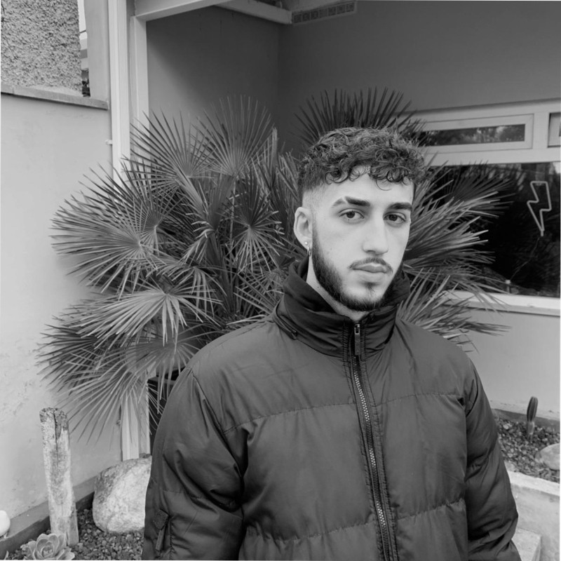

  

# 🧑 About Me

Hello there! I'm Lucas, a Software Engineering student with mention on Cybersecurity. 

## 🛠️ Skills & Tools
I am experienced with a variety of programming languages, including:

- C
- C++
- JavaScript
- Java
- Shell
- And much more!

I strive to stay up-to-date on the latest technologies and continue to expand my skillset. More specifically, I'm passionate about the cybersecurity world and its ever-evolving nature.

## 📚 Projects & Portfolio
I've been part and head of several exciting projects throughout my studies. You can find my portfolio and repositories on [GitHub](https://github.com/lucassaeta?tab=repositories).

  

## 📫 Contact Me
Feel free to reach out to me via email: [lucassaeta2@gmail.com](mailto:lucassaeta2@gmail.com).

# 🏃‍♂️ Connect with Me
Stay updated with my work and connect with me on [LinkedIn](https://www.linkedin.com/in/lucas-saeta/).

    

